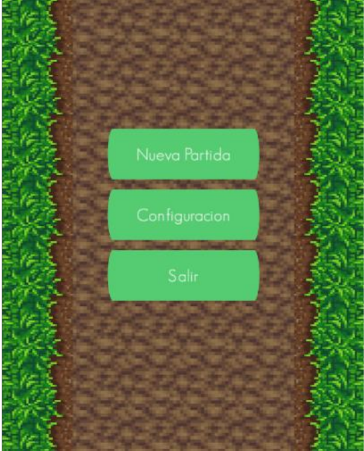
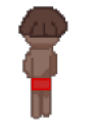
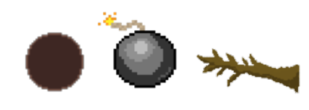
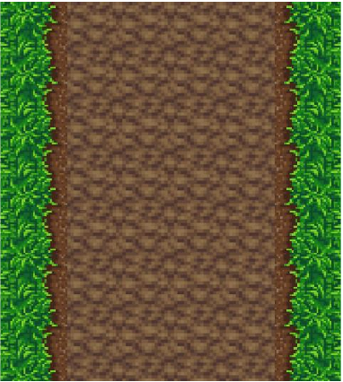
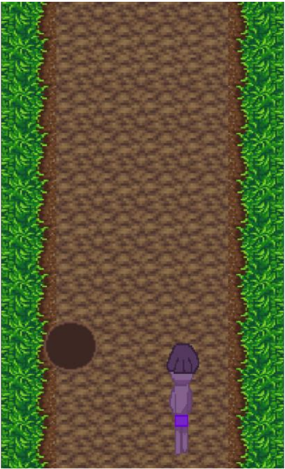

# 1. Disseny
--------------
El joc està ambientat en el descobriment d'Amèrica on el personatge haurà d'escapar
dels colons.

## 1.1. Mecànica

El joc tindrà 3 obstacles que el personatge haurà d'esquivar en tres carrils, mentre corre
els obstacles es desplacen cap a baix i quan el personatge toca l'obstacle s'acaba la
partida.

## 1.2. Interfície

## 1.3. Objectes
### 1.3.1. Personatge
El personatge és un nadiu escapant dels conqueridors, té animació de
moviment.  

### 1.3.2. Obstacles
Els obstacles del joc, són: un forat, una bomba i una branca. Aquests faran que la partida
finalitzi en entrar en contacte amb ells.  

## 1.4. Imatge de fons

## 1.5. Vista del joc

 
