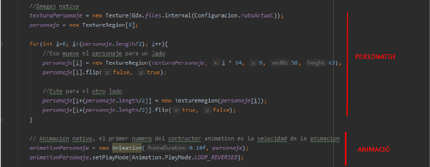

# 2. Implementació de la interfície
-------------
## 2.1. Imatge de fons
Utilitzem la mateixa imatge de fons pel menú que pel joc.  
  

## 2.2. Botons
Utilitzem el tipus de font flat earth.  

## 2.3. Textura del personatge
  
Utilitzem un set de textures creades per nosaltres per donar vida al personatge.
Aquestes permeten el moviment.  
 
## 2.4. Textures dels obstacles
[Veure disseny dels obstacles](disseny.md)  
 

