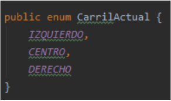
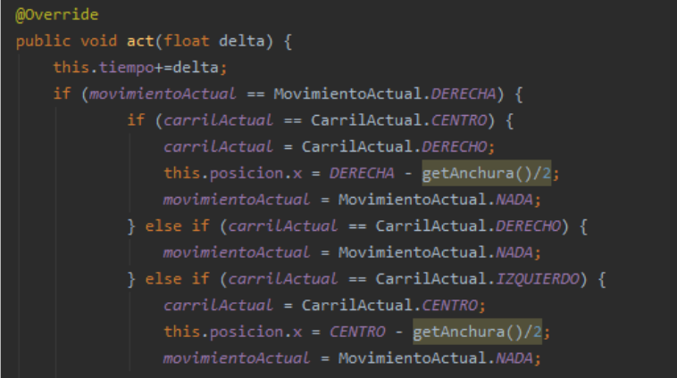
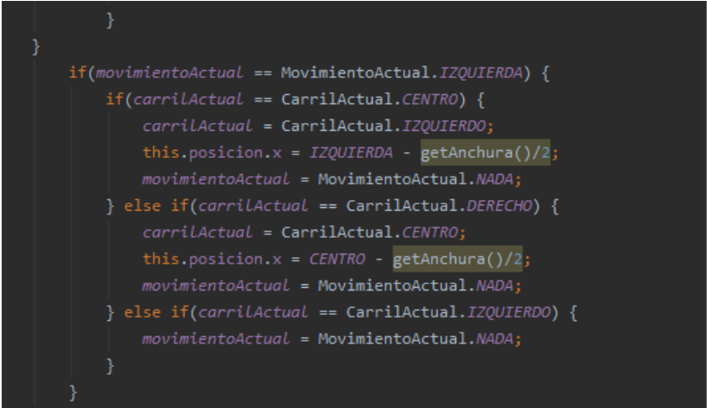

# 3. Implementació de la lògica
---------
## 3.1. Classe “Nativo”
S’encarrega de tot el relacionat amb el personatge principal.
### 3.1.1. Atributs
Conté els atributs de la posició (x, y), altura i amplada del personatge, carril actual,
moviment actual i hitbox entre altres.
### 3.1.2. Moviment
Pel moviment utilitzem un sistema compost per dos components principals: la posició
actual (carrils) i el moviment actual:  
- Carrils: utilitzem tres carrils principals per ubicar el personatge  
  
- Moviment actual: si el jugador llisca cap a l’esquerra, el moviment passarà de
“res” a esquerra i el mateix amb la dreta.  
Posteriorment en el mètode act comprovem el carril actual i el moviment actual del
personatge. Si el moviment es diferent de res i el carril actual ho permet, el personatge
es mourà.  
  

